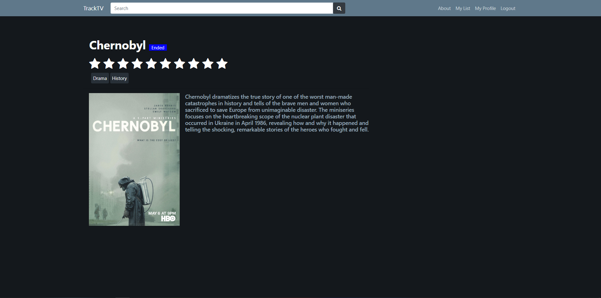

## TrackTV
TrackTV is a website created using Python, Django to allow users to track TV shows they have seen. All data is obtained using [TVmaze API](http://www.tvmaze.com/api).

## Required modules
- Crispy Forms
- requests
- Beautiful Soup
- lxml

## Features
- Allows user registration and login.
- Simply rate the show to add it on your list.
- A list page to list all your shows with your ratings.
- A profile page with info, top 5 shows, etc.

## Screenshots

